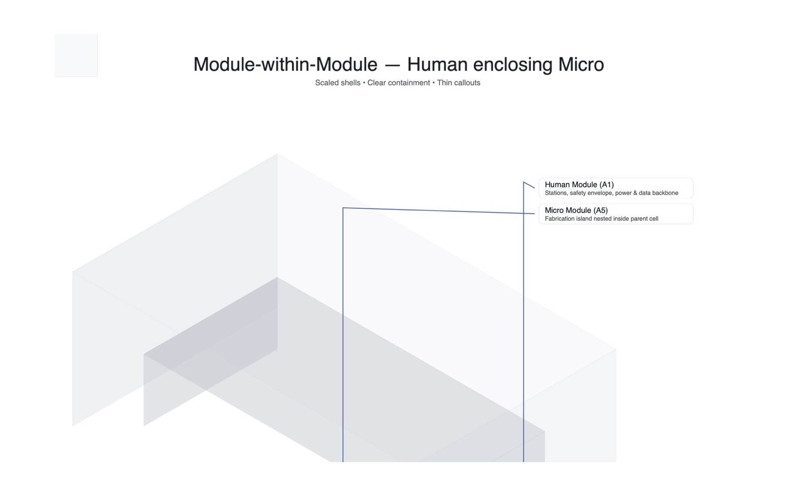

# Factory Paper Size Standard (FPSS) — v1.2

This package fixes README diagrams so they render correctly on GitHub, including a **padded isometric** image to avoid cropping.

**UI template:** open [`ui/index.html`](ui/index.html) locally.  
**Sample job:** `samples/hello_world.fpj`

## Visual Standards

### 1) Nested sizes (proportional cascade)

  

### 2) Isometric — module‑within‑module (padded)

  

### 3) Interface bands (service margins)

  

© 2025 FPSS contributors.
