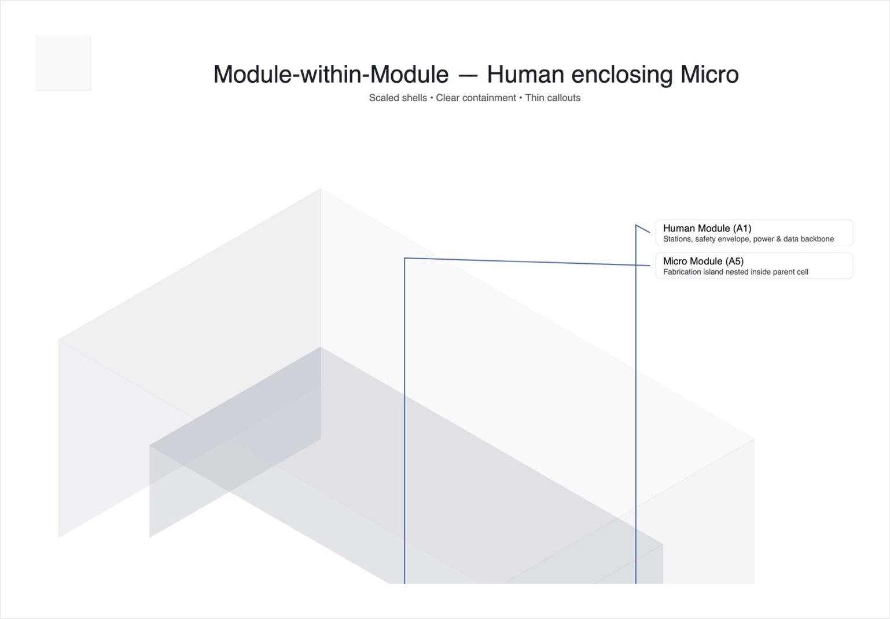

# Factory Paper Size Standard (FPSS) — v1.2

Open, modular standards for building **micro‑tools → tools → factories** across scales — with sustainable energy and ethical materials.

**UI template:** open [`ui/index.html`](ui/index.html).

## Visual Standards

### 1) Nested sizes (proportional cascade)

### 2) Isometric — module‑within‑module

### 3) Interface bands (service margins)

© 2025 FPSS contributors.
