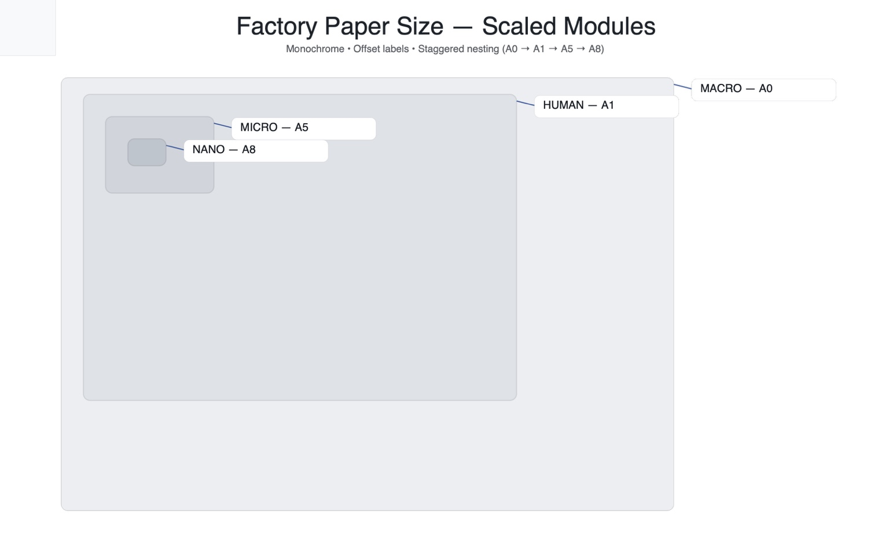
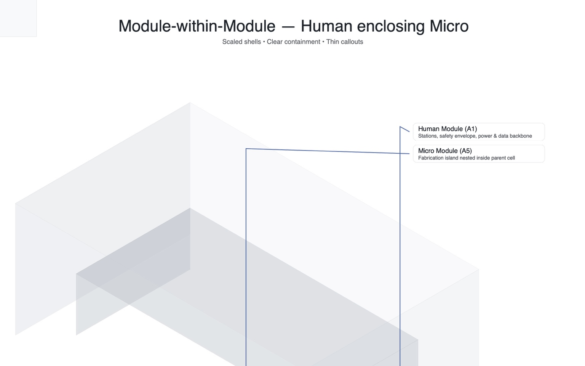
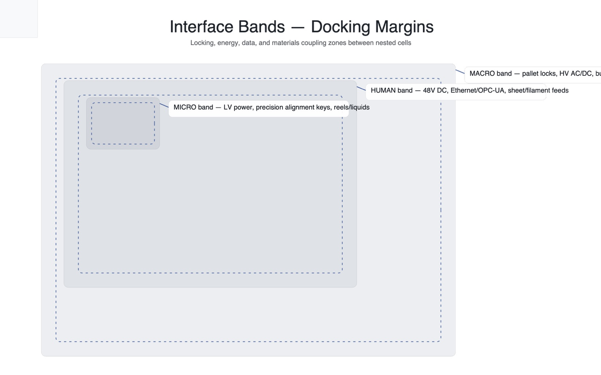

# Factory Paper Size Standard (FPSS) — v1.4 (Docs & Samples Deepen)

Open, modular standards for building **micro‑tools → tools → factories** across scales (Nano, Micro, Human, Macro) with sustainable energy and ethical materials.

**Why FPSS?** A paper‑size‑like cascade (A0/A1/A3/A5…) gives predictable packing, nesting, and interface bands so small cells can compose into larger factories. This repo includes **specs**, **drivers**, **samples**, and a **UI template** (kept in `/ui` in your project).

## Quickstart
1. Open **`ui/index.html`** (from the UI package you already have).
2. Import **`samples/hello_world.fpj`**.
3. Click **RUN** — watch the console and the highlighted running job.
4. (Optional) Connect real hardware via **serial**: see `docs/tutorials/connect_real_hardware_serial.md` and `drivers/serial/fpss_serial.py`.

---

## Visual Standards

### Nested Sizes (proportional cascade)

> **Figure 1:** FPSS nested sizes (A‑series cascade). Smaller modules nest inside larger shells while reserving interface bands.

### Isometric — Module within Module

> **Figure 2:** Isometric view of a **micro** module docked in a **human** module—helps plan clearance, docking bands, and service routing.

### Docking Bands (margins)

> **Figure 3:** Interface bands reserve space for power, comms, and materials to avoid interference between modules.

---

## Repository layout
- **`/spec/`** — human‑readable standards.
  - `visual/` — diagram conventions and grid rules.
  - `interfaces/` — docking margins & **band tables** (CSV + MD).
  - `protocol/` — message catalog, state machine, examples.
  - `vi/` — visual identity tokens (typography, palette, radius, shadows).
- **`/schemas/`** — JSON Schemas (e.g., `.fpj` jobs).
- **`/drivers/`** — reference transports:
  - `serial/` — Python NDJSON serial bridge.
  - `web/` — browser WebSerial helper.
- **`/samples/`** — jobs, materials library, QA recipes, stations manifest.
- **`/docs/`** — tutorials and guides (Hello Micro‑Factory, hardware connect, WebSerial quickstart).

> Looking for the UI? Keep using your existing `/ui` directory (v1.7). This package focuses on **specs + docs + drivers + samples**.

––  
© 2025 FPSS contributors.
