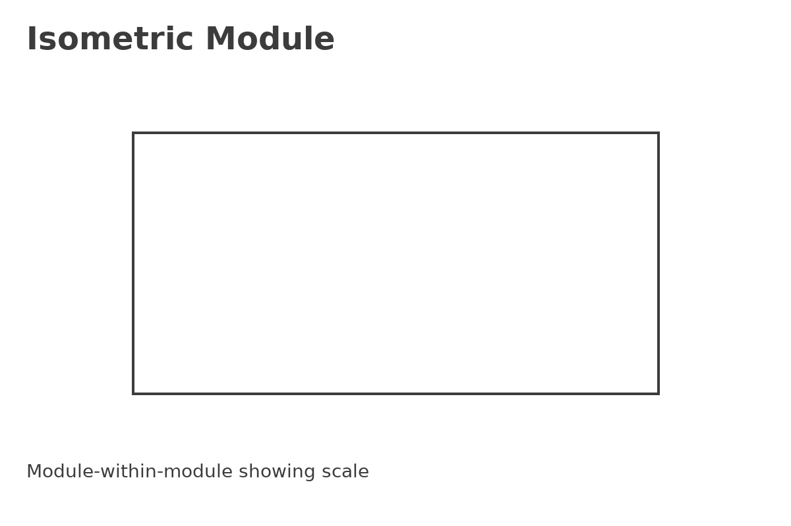

# Factory Paper Size Standard (FPSS) — v1.3

Open, modular standards for building **micro‑tools → tools → factories** across scales — with sustainable energy and ethical materials.

## Quickstart

1. Open [`ui/index.html`](ui/index.html)
2. Import `samples/hello_world.fpj`
3. Click **RUN** to simulate.

## Visual Standards

### Nested sizes (proportional cascade)

### Isometric — module‑within‑module

### Interface bands (service margins)

© 2025 FPSS contributors.
