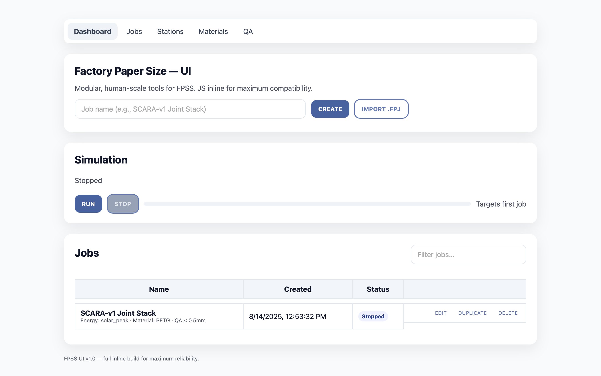

# Factory Paper Size Standard (FPSS)

Open, modular standards for building **micro‑tools → tools → factories** across scales — with sustainable energy, ethical materials, and practical interfaces so small modules can nest into larger ones.

---

## Visual Standards

### 1) Nested Sizes (proportional cascade)


### 2) Isometric: Module Within Module


### 3) Margins & Interface Bands (“fuzzy margins”)


---

## FPSS UI v1.1 — Interactive Demo Interface

A browser‑based control panel for creating and managing FPSS jobs, running simulations, tracking stations/materials, and QA — with a **modular hardware adapter layer**.

**Screenshot**  


**Features**
- Tabs + Hamburger Nav: Dashboard, Jobs, Stations, Materials, QA.
- Jobs: Create, Import `.fpj`/JSON, Edit (modal), Duplicate, Delete, Filter.
- Simulation: Run/Stop progress targeting the first job; job status updates.
- Stations: Start/Stop per station.
- Materials: Add, increment/decrement, delete (persists via `localStorage`).
- QA: Checklist with JSON export (persists).

**Run it**
- **Sim mode (no hardware):** open `ui/index.html` directly.
- **Serial mode (USB/RS‑232):** serve from localhost (required by browsers) then open `http://localhost:8000/ui/`.
  ```bash
  python3 -m http.server
  ```
  In “Connection Settings”, choose **Serial** → Connect → select your port.
- **WebSocket mode:** set your server URL (e.g., `ws://localhost:8765`) in “Connection Settings”.

---

## Hardware Adapter Layer

The UI talks to hardware through a small, swappable API (see `/docs/adapters_concepts.md`).

```js
connect(config)                 // open serial/ws/etc
sendCommand(target, command, params)  // send envelope
getStatus()                     // optional polling/streaming
disconnect()                    // cleanup
```

**Unified message envelope**
```json
{ "target": "station/Printer-A1", "command": "start", "params": { "speed": "normal" } }
```

Adapters can translate this to **G‑code, Modbus, MQTT, CAN, or custom protocols** without changing the UI.

---

## Documentation

- **Overview:** `/docs/index.md`  
- **Quick Start:** `/docs/quickstart.md`  
- **UI Details:** `/docs/ui.md`  
- **Adapters:** `/docs/adapters_concepts.md`, `/docs/adapters_serial.md`, `/docs/adapters_websocket.md`  
- **Schema:** `/docs/schema.md`  
- **FAQ:** `/docs/faq.md`  

If you use GitHub Pages + MkDocs, this repository can publish a browsable site. See `mkdocs.yml` below.

---

## Schema & Samples

- **Job schema:** `schema/fpj.schema.json`  
- **Sample job:** `samples/example.fpj` (import via **Import .FPJ** in the UI)

---

## License & Governance

- Code & docs: Apache‑2.0 (suggested; update as desired).
- Hardware reference designs: CERN OHL‑S or CERN OHL‑W recommended.
- Currency references should be explicit (use **USD**).

---

## Contributing

1. Open an issue with proposals (new sizes, modules, or interfaces).
2. Submit a PR with spec changes, diagrams, UI improvements, adapter additions.
3. For design artifacts (CAD, schematics), include a README and neutral format export.
