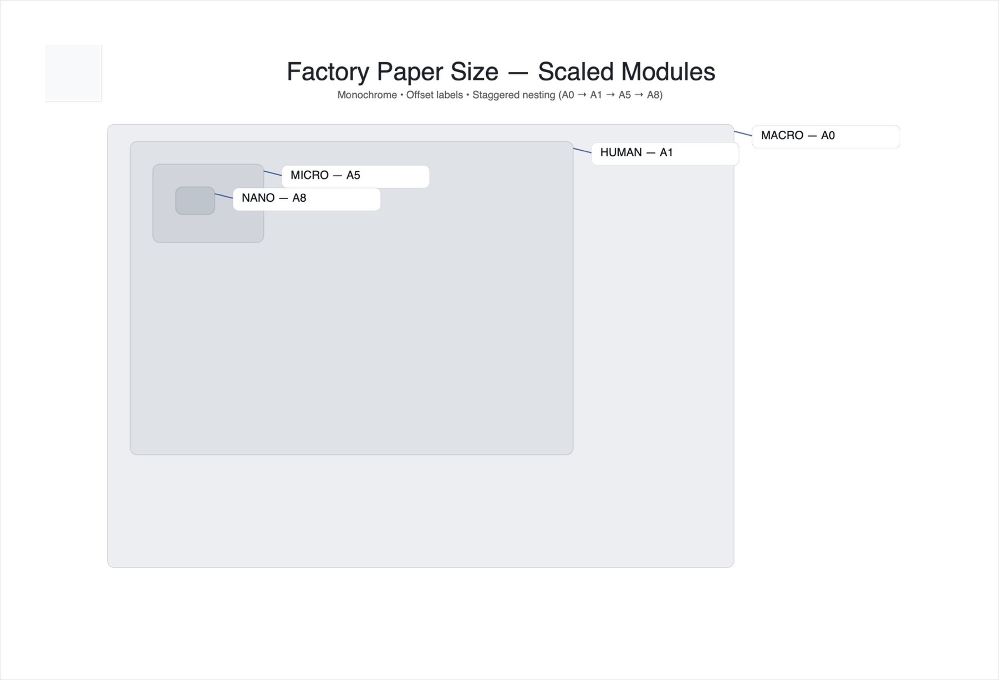
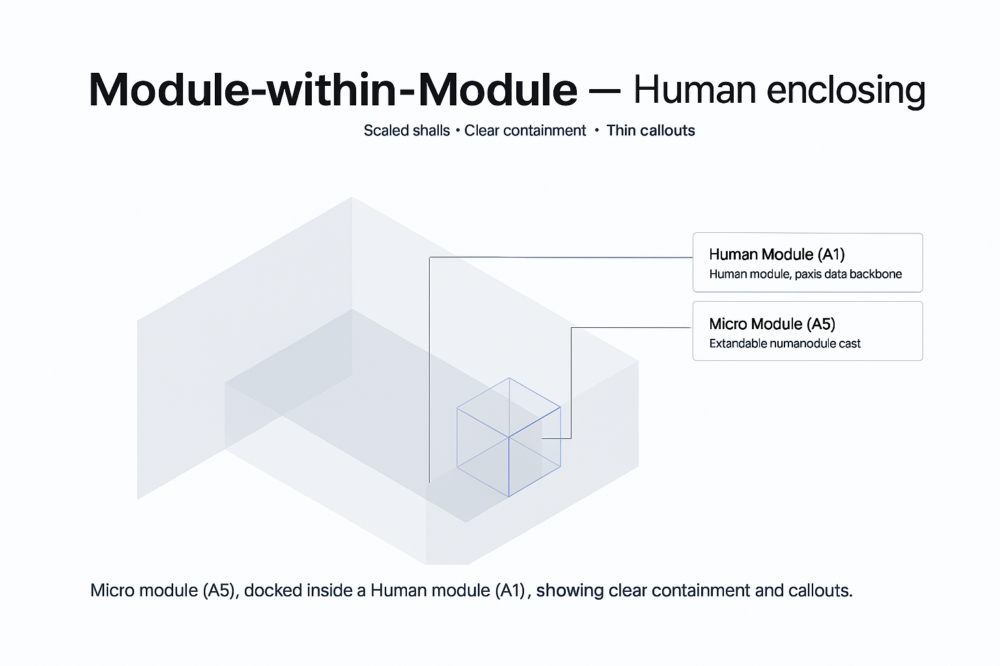
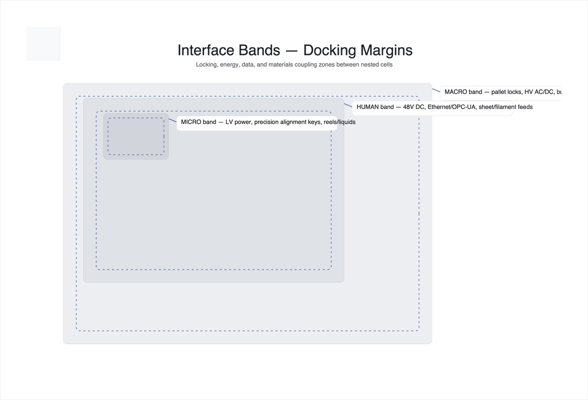

# Factory Paper Size Standard (FPSS) — v1.4 (Docs & Samples Deepen)

Open, modular standards for building **micro‑tools → tools → factories** across scales (Nano, Micro, Human, Macro) with sustainable energy and ethical materials.

**Why FPSS?** A paper‑size‑like cascade (A0/A1/A3/A5…) gives predictable packing, nesting, and interface bands so small cells can compose into larger factories. This repo includes **specs**, **drivers**, **samples**, and a **UI template** (kept in `/ui`).

## Quickstart
1. Open **`ui/index.html`**.
2. Import **`samples/hello_world.fpj`**.
3. Click **RUN** — watch the console and the highlighted running job.
4. Optional hardware: see `docs/tutorials/connect_real_hardware_serial.md` and `drivers/serial/fpss_serial.py`.

---

## Visual Standards

### Nested Sizes (proportional cascade)

> **Figure 1:** Smaller modules nest inside larger shells while reserving interface bands.

### Isometric — Module within Module

> **Figure 2:** Spatial containment view (clearance, bands, service routing).

### Docking Bands (service margins)

> **Figure 3:** Reserved margins for power, comms, materials; prevents interference.

---

## Repository layout
- **`/spec/`** — standards  
  - `visual/` (diagram/grid rules)  
  - `interfaces/` (docking margins + `bands.csv`)  
  - `protocol/` (messages, state machine, examples)  
  - `vi/` (typography, palette, radius, shadows)
- **`/schemas/`** — JSON Schemas (e.g., `.fpj` jobs)
- **`/drivers/`** — transports  
  - `serial/` (NDJSON bridge)  
  - `web/` (WebSerial helper)
- **`/samples/`** — jobs, materials, QA recipes, stations
- **`/docs/`** — tutorials (Hello Micro‑Factory, hardware connect, WebSerial)

> UI lives in `/ui` (v1.7). This repo’s focus: **specs + docs + drivers + samples**.

––  
© 2025 FPSS contributors.
